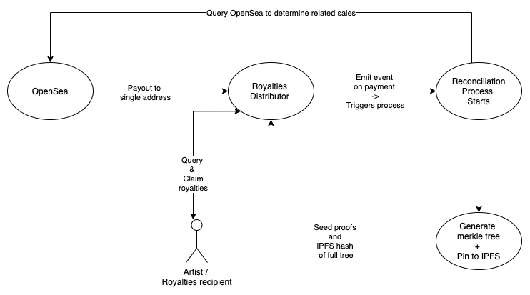

# merkle-royalties-distributor

Non-custodial royalties distributor driven by Merkle Trees

Main contract code `./contracts/MerkleVault.sol`

Based on token distribution merkle magic from `Uniswap` and `OpenZeppelin`

## The flow



## Generating your tree from OpenSea events

Have a look at:
```
./scripts/opensea/ko.sh
```

It's an example script which shows how to run the OS events task to fetch data from OpenSea and then generate a merkle
tree off the back of that

Once you have generated your tree and pushed to IPFS, you can deploy your vault or upgrade the tree version by pausing
the contract

The script depends on:

- Knowing the NFT to scan for events
- Dates for filtering (unix second stamps)
- The percentage of sales the vault will get
- Of the funds that land in the vault, what percentage of those funds go to the platform
- The account that will receive the platform commission
- The next version number of the merkle tree

## Reconciling who has not claimed

Between merkle tree versions, you need to carry forward who has not claimed in the previous tree.

The flow is:

- Pause the contract
- Run the reconciliation task against the current version of the tree
- It will generate a JSON file with all the beneficiaries that have not claimed ETH and the amount they have unclaimed
- This then needs to be merged with the nodes from the next version of the tree taking care to factor in that a
  beneficiary may have received more ETH since the last version of the tree

You would do this by running:
```
./scripts/reconcile.sh
```

It will also tell you how much ETH has landed in the contract since your customers have claimed.

## All together

Let's say you had a merkle tree live in the vault, if you wanted to work out who had claimed, how much ETH had been received since the last merkle version and then add in any new beneficiaries that had done sales on open sea, you would likely run the following scripts all together:
```
./scripts/get-deposits.sh       
./scripts/reconcile.sh   
./scripts/ko.sh         
./scripts/merge.sh      
```

It is important that `merge` is run last as it will merge the list of beneficiaries that had not claimed ETH in the current version of the tree with the new beneficiaries that are able to claim the new ETH received to the vault

Update `start` and `from` blocks to be the last time the tree was update upto the most recent deposit of ETH.

you can finally push to ipfs by running

```
./scripts/ipfs.sh
```

But do check through these scripts. They are configured with example parameters that you can change and automate yourself.

### Deployments in the wild

**DEPLOY YOUR OWN VERSION - YOU CANNOT USE THESE**

```
KnownOrigin:

Mainnet: 0x11B0D9AFD49Dc36D86DEa579d0D11771a4f2f54b
Rinkeby: 0x67b72140269cfc18516cace5fcf4237706657de0
```

For information on the first version of the merkle tree deployed to the KnownOrigin vault, please read [here](./data/os_export/README.md)
